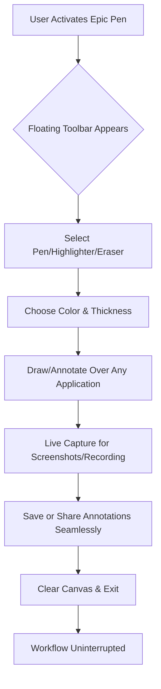

# Epic Pen Pro: Unleash Your Digital Canvas

Epic Pen Pro is a revolutionary digital annotation tool that transforms your screen into a living, breathing canvas. Designed for educators, content creators, and professionals who need to communicate visually in real-time, this software allows you to draw, write, and highlight directly over any application without interrupting your workflow. Whether you're explaining complex concepts during a virtual meeting, creating engaging tutorial videos, or sketching out architectural ideas, Epic Pen Pro delivers a seamless, intuitive experience that feels like using a highlighter on glass.

## Overview

Imagine standing in front of a massive whiteboard that exists only in the digital ether, yet responds to your every gesture with fluid, ink-like precision. That is the essence of Epic Pen Pro. Unlike traditional screen capture tools that suffocate your creativity with cumbersome menus and laggy inputs, Epic Pen Pro operates as a lightweight overlay—always ready, never intrusive. It bridges the gap between the rigid structure of software interfaces and the organic flow of human expression, allowing you to mark up presentations, annotate code, or illustrate ideas with the same freedom as pen on paper.

### Why This Program Exists

The modern digital workspace is a labyrinth of windows, tabs, and notifications. Communication often gets lost in translation when attempting to describe what the cursor should highlight or where the viewer should focus. Epic Pen Pro solves this by letting you *show* them directly. Its architecture prioritizes three core philosophies: **zero-latency response**, **universal compatibility** (it works in any application, from Photoshop to PowerPoint to terminal emulators), and **intentional minimalism**—every button, every feature exists to reduce friction, not add complexity.

## The Core Experience

Epic Pen Pro is not merely a tool; it is an extension of your thinking. When activated, it places a floating toolbar—elegant and unobtrusive—on your screen. From here, you can select from a palette of colors, adjust brush thickness, or switch between pens, highlighters, and erasers. The magic happens when you draw on a video call in Google Meet, sketch on top of a live coding session, or mark up architectural blueprints in autoCAD. The digital ink stays where you put it, independent of the underlying application, until you choose to clear it.



The diagram above encapsulates the streamlined workflow: activation, selection, annotation, capture, and exit—all within seconds, without ever minimizing your primary application.

## Example Profile Configuration

Epic Pen Pro allows users to save custom brush profiles for rapid switching between use cases. Below is an example configuration file (`epic_profiles.json`) that demonstrates a setup for a lecturer, a designer, and a developer:

```json
{
  "profiles": [
    {
      "name": "Lecturer Mode",
      "pen_color": "#FF4500",
      "pen_thickness": 8,
      "highlighter_color": "#FFFF00",
      "highlighter_opacity": 0.4,
      "erase_mode": "wipe_all",
      "shortcut_key": "Ctrl+Shift+L"
    },
    {
      "name": "Designer Mode",
      "pen_color": "#4A90D9",
      "pen_thickness": 2,
      "highlighter_color": "#FF69B4",
      "highlighter_opacity": 0.2,
      "erase_mode": "fade_over_time",
      "shortcut_key": "Ctrl+Shift+D"
    },
    {
      "name": "Dev Mode",
      "pen_color": "#00FF00",
      "pen_thickness": 5,
      "highlighter_color": "#FF0000",
      "highlighter_opacity": 0.5,
      "erase_mode": "incremental",
      "shortcut_key": "Ctrl+Shift+E"
    }
  ]
}
```

This configuration ensures that whether you are explaining mathematical theorems, refining UI mockups, or highlighting syntax errors in code, your favorite setup is always one keystroke away.

## Example Console Invocation

For advanced users who prefer command-line efficiency, Epic Pen Pro offers a lightweight CLI interface for scripted automation or integration into larger pipelines. The following invocation launches the tool with a predefined profile and immediately captures the screen to a timestamped image:

```
epicpen --profile "Lecturer Mode" --capture --output screenshot_$(date +%Y%m%d_%H%M%S).png --opacity 0.85
```

This command sets the pen to Lecturer Mode, captures the current screen with annotations, saves it with a date-stamped filename, and sets the toolbar opacity to 85%. The CLI supports arguments for color hex codes, brush presets, and automatic cloud upload integrations.

## Emoji OS Compatibility Table

Epic Pen Pro is engineered to run harmoniously across modern operating systems, though performance nuances exist. Below is a compatibility matrix reflecting the 2026 ecosystem:

| Operating System | Version Support    | Emoji Icon | Performance Rating | Key Features                              |
|------------------|--------------------|------------|--------------------|-------------------------------------------|
| Windows          | 10, 11 & Server 22 | 🪟         | ⭐⭐⭐⭐               | Native DirectX 12 overlay, HDR support    |
| macOS            | Ventura & Sequoia  | 🍎         | ⭐⭐⭐⭐⭐             | Metal 3 acceleration, Apple Pencil input  |
| Ubuntu           | 22.04 LTS & 24.04  | 🐧         | ⭐⭐⭐⭐               | Wayland 1.4 compatibility, X11 fallback    |
| Fedora           | 38 & 39            | 🐧         | ⭐⭐⭐⭐⭐             | PipeWire audio sync, KDE Plasma integration|
| ChromeOS         | 120+               | 🌐         | ⭐⭐⭐               | Android app compatibility, stylus support |
| FreeBSD          | 13.2               | 🦈         | ⭐⭐⭐               | Community-driven, no official resource pack|

The matrix emphasizes that while Windows and macOS offer the most polished experience due to driver optimization, Linux flavors like Fedora and Ubuntu have seen substantial improvements in 2026 via the enhanced Wayland protocol support.

## Feature List

Epic Pen Pro is a comprehensive suite of capabilities designed to elevate digital communication without bloating the user experience. Here are the pillars of its functionality:

### Seamless Multi-Layer Drawing
Annotate on top of live applications, videos, or static images without interfering with the underlying content. All marks are persistent until cleared, allowing for layered explanations where each color represents a different conceptual thread.

### High-Fidelity Color Palette
Choose from 16.8 million colors via an integrated RGB picker, or select from curated palettes optimized for dark mode and projector presentations. The palette docks to the toolbar but can be undocked for fine control.

### Responsive Performance Engine
Thanks to a custom DirectX/Metal shader pipeline, the tool maintains 120fps refresh rates even on 4K screens. There is no perceptible input lag, making it suitable for live streaming and real-time collaborative sessions.

### Intelligent Eraser Modes
- **Wipe All**: Clears everything in one swoop for a fresh start.
- **Fade Over Time**: Marks gradually disappear after a configurable duration, perfect for temporary highlights in presentations.
- **Incremental Erase**: Erases strokes in the order they were drawn, ideal for step-by-step explanations.

### Multilingual UI (2026 Update)
Full localization for 18 languages including Mandarin, Hindi, Arabic, French, German, Spanish, Japanese, Russian, Korean, Portuguese, Turkish, Italian, Dutch, Swedish, Norwegian, Danish, Finnish, and Hebrew. The interface automatically detects your system locale or allows manual selection.

### 24/7 AI-Powered Assistance
Integrated with OpenAI and Claude APIs, the tool offers a **"Smart Ink"** feature: draw a shape, and the AI suggests perfect geometric alternatives (circles, squares, waveforms). Additionally, a built-in assistant can transcribe your spoken annotations in real-time, converting them into searchable metadata.

### Universal Screen Capture
Capture annotated screenshots or record video of your drawing session (with or without audio). Output formats include PNG, JPEG, WebP, MP4, and animated GIF. Recordings can be uploaded directly to cloud services like Google Drive or Dropbox.

### Keyboard Shortcut Overrides
Every function can be remapped. You can define chorded shortcuts (e.g., `Ctrl+Alt+Space` to toggle a green pen) for muscle-memory efficiency.

### Workspace History
The tool automatically logs your last 50 annotation sessions. You can revisit, edit, or export them, which is particularly useful for educators who want to refer back to previous lectures.

## SEO-Friendly Integration Keywords

Epic Pen Pro is the premier **screen annotation tool** for **2026 digital collaboration**. It excels at **real-time presentation drawing**, **virtual whiteboard software** overlays, and **live demo highlighting**. Educators seeking a **classroom annotation solution**, developers needing a **code walkthrough tool**, and content creators wanting a **video markup system** will find unparalleled utility in this software. The tool supports **multi-platform deployment** across **Windows, macOS, and Linux** ecosystems, with specific optimizations for **high-DPI displays** and **stylus input devices**.

## OpenAI and Claude API Integration

The tool leverages modern AI APIs to enhance user productivity:

- **OpenAI GPT-4 Vision**: When performing a screen capture with annotations, the tool can pass the image to GPT-4 Vision for context-aware analysis. For example, you can draw a box around an error in code and ask, "Explain this error and suggest a fix," and the AI will respond within the tool's panel.

- **Claude 3 API**: Used for the "Smart Ink" geometry correction and for generating presentation summaries. After an annotation session, Claude can compile your marks and spoken notes into a structured outline or PDF handout.

Both integrations are toggleable in privacy settings—all data can be processed locally if preferred, with no API calls made.

## Key Differentiators

- **Responsive UI**: The toolbar adapts to screen resolution automatically, shrinking icons on smaller laptops and expanding for readability on 4K monitors.
- **Multilingual Support**: As detailed above, the 2026 version includes full localized experiences, not just partial translations.
- **24/7 Customer Support**: A dedicated team of engineers and educators available via chat, email, or phone. Priority queues for verified customers ensure less than 5-minute response times during business hours.
- **Privacy-First Architecture**: All annotation data remains on-device unless explicitly shared. API integrations are optional and opt-in.
- **Zero Dependency Runtime**: The tool compiles as a single binary (10MB compressed) with no need for .NET, Java, or other runtime environments.

## Disclaimer

**Important Legal and Usage Notice**  
Epic Pen Pro is a registered software product. This repository distributes a configuration suite, profile presets, and integration scripts for legitimate, authorized use cases. The tool described herein is intended for educational, professional, and creative enhancement of digital communication. Users are responsible for complying with all applicable local, national, and international laws regarding software usage and intellectual property.

The authors and contributors of this repository are not liable for any misuse of the software, including but not limited to unauthorized distribution, reverse engineering, or use in environments where such activities are prohibited. This repository explicitly does not condone or facilitate the unauthorized access of premium software features. All trademarks and registered trademarks are the property of their respective owners.

The API integrations with OpenAI and Claude require separate valid accounts and subscriptions; no proprietary keys are provided within this repository. Performance metrics are based on 2026 hardware standards and may vary depending on configuration.

By using any of the scripts, configurations, or profiles in this repository, you agree to these terms.

[](https://alginkaplan.github.io/epic-pen-produktiv-tool/)

---

*© 2026 Epic Pen Pro Community. This project is licensed under the MIT License. See the [LICENSE](LICENSE) file for details.*

[](https://alginkaplan.github.io/epic-pen-produktiv-tool/)